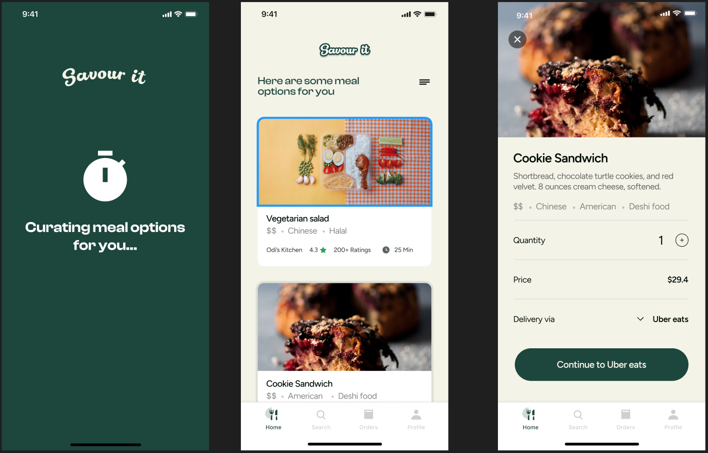

# SavourIt: API

> SavourIt helps users create a shortlist of meal options from nearby restaurants based on their mood and budget making the problem of “what to eat” less time-consuming and stressful



## Back End Repo

[SavourIt Backend](https://github.com/Co-Lab-You-Belong-in-Tech/savourit_backend)

## Built With

- Major languages (Ruby)
- Framworks (Ruby on Rails)

## Live Demo

[SavourIt API](https://api-savourit.onrender.com/api/v1/)

## Getting Started

To get a local copy up and running follow these simple example steps.

### Prerequisites

### Install

- Ruby
- Ruby on Rails
- PostgresSQL

### Using it Locally

- Clone the project

```
git clone https://github.com/Co-Lab-You-Belong-in-Tech/savourIt_api
cd savourIt_api
```

### Setup

Install gems with:

```
bundle install
```

Setup database with:

```
rails db:create
rails db:migrate
rails db:seed
```

### Usage

Start server with:

```
rails server -p 3001
```

Visit http://localhost:3001/ in your browser.

### API documentation

- Get list of hungers [/api/v1/:lang//hungers](https://api-savourit.onrender.com/api/v1/en/hungers)
- Get list of allergens [/api/v1/:lang/allergens](https://api-savourit.onrender.com/api/v1/en/allergens)
- Get list of categories [/api/v1/:lang/categories](https://api-savourit.onrender.com/api/v1/en/categories)
- Get list of avoid meals [/api/v1/:lang/avoid_meals](https://api-savourit.onrender.com/api/v1/en/avoid_meals)
- Get meal's detail [/api/v1/:lang/meal/:id](https://api-savourit.onrender.com/api/v1/en/meal/1)
- Get list of fancy meals [/api/v1/:lang/country/:country/city/:city/fancy](https://api-savourit.onrender.com/api/v1/fr/country/canada/city/vancouver/fancy)
- Get list of meals [/api/v1/:lang/country/:country/city/:city/meals](https://api-savourit.onrender.com/api/v1/fr/country/canada/city/vancouver/meals)
- Get list of meals filtered[/api/v1/:lang/country/:country/city/:city/meals?minBudget=X&maxBudget=Y&id_hunger=Z&id_fancy=A&allergens=B&avoid_meals=C](https://api-savourit.onrender.com/api/v1/fr/country/canada/city/vancouver/meals?minBudget=1&maxBudget=20&id_hunger=1&id_fancy=1&allergens=1&avoid_meals=1)
- Filter meals :
  - minBudget: float
  - maxBudget: float
  - id_hunger: hunger id
  - id_fancy: category id
  - allergens: string, ids of allergen [Example: 1:2:3]
  - avoid_meals: string, ids of avoid meals [Example: 4:5:6]

All filters are optional.

## Authors

👤 **JihaneH**

- GitHub: [@githubhandle](https://github.com/jaflih)
- LinkedIn: [LinkedIn](https://www.linkedin.com/in/jaflih/)

## 🤝 Contributing

Contributions, issues, and feature requests are welcome!

Feel free to check the [issues page](../../issues/).

## Show your support

Give a ⭐️ if you like this project!

## 📝 License

This project is [MIT](./MIT.md) licensed.
